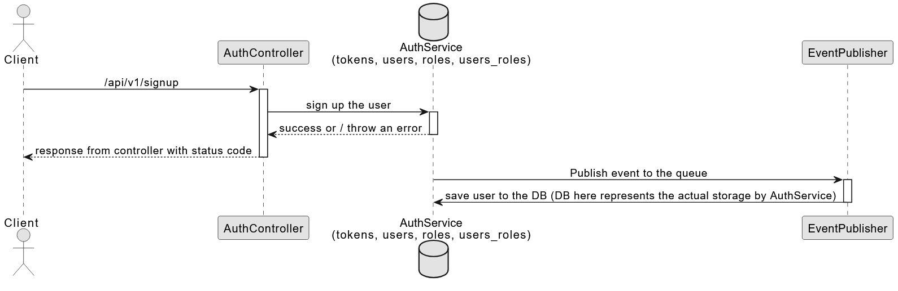
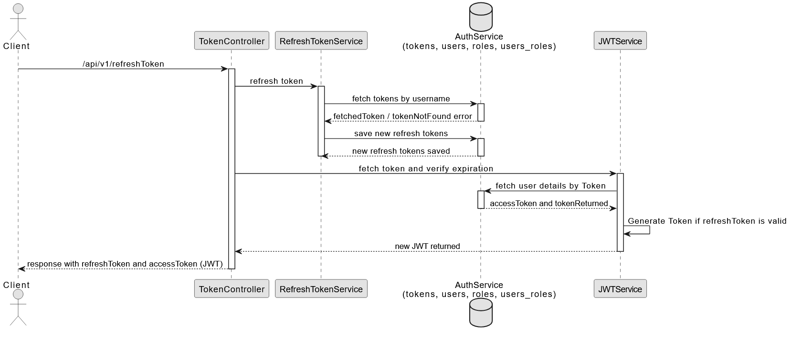

# Spring Boot + Kafka Authentication Service

This project is an authentication service built using Spring Boot, Kafka, and JWT. It leverages a microservices architecture with event-driven design and is Dockerized for easy deployment. The service handles user registration, JWT-based authentication, and refresh tokens, while also publishing user-related events to Kafka.

---

## Key Features

* **JWT Authentication**: Secure user login using JWT (JSON Web Tokens).
* **User Registration**: Users can register with basic information like username, password, email, etc.
* **Refresh Tokens**: Supports JWT refresh tokens for handling long sessions.
* **Event-Driven**: Kafka is used to publish user-related events (e.g., user registration).
* **Dockerized**: The service is containerized for easy deployment.

---

## Table of Contents

* [How the Project Works](#how-the-project-works)
    * [1. Architecture Overview](#1-architecture-overview)
    * [2. User Authentication Flow](#2-user-authentication-flow)
    * [3. Event-Driven Architecture with Kafka](#3-event-driven-architecture-with-kafka)
    * [4. Security and Token Management](#4-security-and-token-management)
    * [5. Method-Level Security](#5-method-level-security)
    * [6. Database Design](#6-database-design)
    * [7. Why Kafka?](#7-why-kafka)
    * [8. User Details Service](#8-user-details-service)
    * [9. JWT and Spring Security Integration](#9-jwt-and-spring-security-integration)
* [Requirements](#requirements)
* [Setup](#setup)
    * [Docker Setup](#docker-setup)
    * [Local Setup](#local-setup-without-docker)
* [Usage](#usage)
    * [API Endpoints](#api-endpoints)
    * [Kafka Integration](#kafka-integration)
* [License](#license)

---

## How the Project Works

This project implements an authentication and user management system with an event-driven architecture using Kafka. Below is a high-level overview of how it works:

### 1. Architecture Overview

This project is designed using **microservice principles** with an **event-driven architecture**. It handles user authentication and management, providing a secure mechanism for login, registration, and token-based authentication. Key technologies used in this project include **Spring Boot**, **Kafka**, and **JWT**. The system also leverages a relational database (such as PostgreSQL or MySQL) to persist user information and refresh tokens.

**High-Level Components:**

* **Spring Boot Application**: The core of the service, providing RESTful APIs for user authentication, registration, and JWT token management.
* **Kafka**: An event streaming platform used for asynchronous communication between services. When a user registers, an event containing the user's information is published to Kafka.
* **Database**: Stores user credentials, roles, and refresh tokens, ensuring data persistence.
* **JWT**: Used for stateless authentication. The user receives a JWT upon successful login, which is then used for subsequent authenticated requests.

### 2. User Authentication Flow

The user authentication flow consists of the following steps:

#### Step 1: User Registration

1.  The user sends a `POST` request to `/auth/v1/signup` with their registration data (e.g., username, password, email, etc.).
2.  The system validates the data and checks whether the username already exists in the database.
3.  If valid, the password is **hashed using a strong password encoder** before being stored in the database.
4.  A user record is created in the `users` table of the database, and any relevant roles (e.g., `USER`, `ADMIN`) are assigned to the user.
5.  Once the user is successfully registered, a `UserInfoEvent` is created and **published to a Kafka topic**. This event contains the user's details such as name, email, phone number, and user ID.

#### Step 2: JWT Token Generation

1.  After successful registration, users can authenticate by sending a `POST` request to `/auth/v1/login` with their username and password.
2.  If the username and password match, the system generates a **JWT token with a set expiration time** (usually 1 hour). This token is signed using a secret key and contains user-specific data (like `userId`, roles, and permissions).
3.  The JWT token is returned to the user, and this token should be included in the `Authorization` header of any subsequent requests to access protected resources.

#### Step 3: Refresh Tokens

1.  Along with the JWT, a **refresh token** is issued to the user. The refresh token has a much longer expiration period (typically 7 days).
2.  The refresh token is stored in the database and can be used to obtain a new JWT token once the current JWT expires.
3.  To obtain a new JWT, the user can send a `POST` request to `/auth/v1/refresh-token` with their refresh token. If the refresh token is valid and not expired, the system issues a new JWT token.

#### Step 4: Secure Resource Access

1.  Whenever a user wants to access a protected resource, they must include their JWT token in the `Authorization` header of the request (e.g., `Bearer <JWT>`).
2.  The system verifies the JWT token's authenticity and checks whether the user has sufficient permissions to access the requested resource.
3.  If the JWT is valid and the user has the appropriate permissions, access is granted. If not, the system returns a `401 Unauthorized` error.

### 3. Event-Driven Architecture with Kafka

One of the core features of this project is its **event-driven architecture**, which is facilitated by Kafka. Here’s how Kafka plays a crucial role:

#### User Registration Event

* After a user successfully registers, a `UserInfoEvent` is created containing the user’s registration details (name, email, phone number, etc.).
* This event is **published to a Kafka topic**, where it can be consumed by other microservices or systems that are interested in user data. This allows **asynchronous processing and decoupling** between services.

#### Kafka Producer

* The `UserInfoProducer` class is responsible for sending the `UserInfoEvent` to Kafka.
* The `UserInfoSerializer` class is used to serialize the `UserInfoEvent` into a format suitable for Kafka consumption (i.e., converting it to JSON).

#### Kafka Consumer

* In a real-world scenario, there might be other microservices that consume the Kafka topic containing user events. For example, a notification service might listen for new user registrations and send a welcome email, or an analytics service might track user registrations for metrics.
* The event-driven model allows these services to work **independently and asynchronously**, reacting to changes in the system without direct coupling between services.

### 4. Security and Token Management

The system uses JWT tokens for authentication and refresh tokens for session management:

#### JWT Authentication

* **JWT tokens** are used to authenticate users in a **stateless manner**, meaning the server doesn’t need to store session information.
* The JWT contains **claims** (user data and roles) that are validated each time a request is made. Once a user is authenticated, they can access protected resources by including the token in the `Authorization` header.

#### Refresh Tokens

* **Refresh tokens** are used to refresh expired JWT tokens without requiring the user to re-enter their credentials.
* The refresh token is stored in the database with an expiration date. If the token is expired, the user needs to re-authenticate.
* The system handles the creation, validation, and expiration of both JWT and refresh tokens efficiently. This approach ensures both **security and a smooth user experience**.

### 5. Method-Level Security

Beyond securing entire API endpoints, this project implements method-level security to provide granular access control based on user roles or permissions. This allows for fine-tuned authorization, ensuring that specific actions or business logic methods can only be executed by users with the appropriate privileges.

####  How it Works:
Spring Security's `@PreAuthorize` annotation is used directly on methods within controllers or service classes. This annotation leverages Spring Expression Language (SpEL) to define authorization rules. 

### 6. Database Design

The database is designed with relational tables to store user-related data, roles, and refresh tokens.

#### Tables

* **Users Table (`users`)**: Stores basic user information such as `userId`, `username`, `password`, etc.
    * **Columns**: `userId` (PK), `username`, `password`, `email`, `phoneNumber`
* **Roles Table (`roles`)**: Stores different roles that users can have (e.g., `USER`, `ADMIN`).
    * **Columns**: `roleId` (PK), `name`
* **User Roles Table (`users_roles`)**: A many-to-many relationship table linking users to their roles.
    * **Columns**: `userId` (FK), `roleId` (FK)
* **Refresh Tokens Table (`tokens`)**: Stores refresh tokens with an expiration date associated with the user.
    * **Columns**: `id` (PK), `userId` (FK), `token`, `expiryDate`

#### ER Diagram

The Entity Relationship (ER) diagram for the database represents how the different entities (User, Role, Refresh Token) are related:


This diagram shows the relationships between the `users`, `roles`, and `tokens` tables.

### 7. Why Kafka?

Kafka is used in this application for several reasons:

* **Asynchronous Communication**: Kafka allows different components of the system to communicate asynchronously, decoupling the user registration flow from other services that need to process the user event.
* **Scalability**: Kafka can handle a large volume of events in real-time, which is crucial as the system scales to handle millions of users or events.
* **Event Sourcing**: Kafka allows us to build an event-sourced architecture where the entire state change (like user registration) is captured as an event that can be replayed or audited later.
* **Fault Tolerance**: Kafka provides fault tolerance through data replication across brokers, ensuring that no event is lost even in case of failure.

### 8. User Details Service

The `UserDetailsServiceImpl` class is an implementation of Spring Security’s `UserDetailsService` interface. This service loads user-specific data (like roles and password) from the database when a user tries to authenticate:

* The `loadUserByUsername` method checks the user’s credentials against the database, and if found, it returns a `CustomUserDetails` object.
* The `CustomUserDetails` class extends the `UserInfo` entity and implements `UserDetails` to integrate user data into the Spring Security framework.

This setup ensures that user authentication and authorization are properly handled in a **secure and extensible way**.

### 9. JWT and Spring Security Integration

Spring Security is used to secure API endpoints and to validate JWT tokens:

* **JWT Filter**: The system implements a custom filter that intercepts incoming requests to check for a valid JWT in the `Authorization` header.
* **Security Configuration**: Spring Security configuration defines which endpoints are protected and which are open. For instance, the authentication endpoints are publicly accessible, while other protected resources require a valid JWT token.

**Conclusion**

This authentication service is a **robust and scalable solution** built on a solid event-driven architecture with Kafka, JWT for stateless authentication, and a secure database structure. It allows for easy user management, token refresh, and provides an extensible foundation for integration with other services in a microservices architecture.

---

## Requirements

* Java 17 or higher
* Gradle (to build the project)
* Docker (for containerization)
* Kafka (can be Dockerized or set up locally)

---

## Setup

### Docker Setup

This project is Dockerized, making it easy to deploy and run. It comes with a `docker-compose.yml` file to manage the required services, including Kafka and the Spring Boot application.

**Steps to Set Up Using Docker:**

1.  Clone the repository:
    ```bash
    git clone https://github.com/Srinidhi-Yoganand/authService-SpringBoot.git
    cd authService-SpringBoot
    ```
2.  Build and start the application using Docker Compose:
    ```bash
    docker-compose up --build
    ```
    This command will:
    * Build the Spring Boot application Docker image.
    * Start a Kafka container.
    * Start the Spring Boot application container.
3.  Access the application: Once the containers are up and running, you can access the application through `http://localhost:8080`.

### Local Setup (Without Docker)

1.  Clone the repository:
    ```bash
    git clone https://github.com/Srinidhi-Yoganand/authService-SpringBoot.git
    cd authService-SpringBoot
    ```
2.  Build the application using Gradle:
    ```bash
    ./gradlew build
    ```
3.  Run the application locally:
    ```bash
    ./gradlew bootRun
    ```
4.  Access the application: The Spring Boot application will be available at `http://localhost:9898`.

---

## Usage

Once the application is running, you can use the following features:

- **Sign Up**: To register a new user, send a POST request to `/auth/v1/signup` with user details in the request body.


- **Login**: Send a POST request to `/auth/v1/login` with the username and password to receive a JWT token.


- **Token Refresh**: Use a valid refresh token to get a new JWT token via `/auth/v1/refresh-token`.


- **Ping**: Send a GET request to `/auth/v1/ping` to get the current user's ID (provided they are authenticated).

## License

This project is licensed under the MIT License - see the [LICENSE](LICENSE) file for details.
