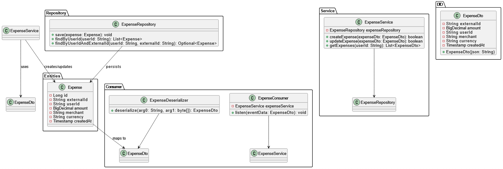

# Expense Service

## Overview

The **Expense Service** is a Spring-based application designed to manage expenses through Kafka messaging. It listens for expense-related messages from a Kafka topic, processes them, and stores the information in a MySQL database. This service supports operations such as creating and updating expenses, as well as retrieving the expense details for a specific user.

The service uses Kafka for event-driven architecture and MySQL for persistent storage.

---

## Index

1. [Overview](#overview)
2. [Technologies Used](#technologies-used)
3. [Architecture](#architecture)

   * [Theory](#theory)
   * [Implementation](#implementation)
4. [UML Diagram](#uml-diagram)
5. [Setting Up the Project](#setting-up-the-project)
6. [Using the Project](#using-the-project)
7. [License](#license)

---

## Technologies Used

* **Spring Boot**: Framework for creating production-ready applications.
* **Apache Kafka**: Used for event-driven messaging between services.
* **MySQL**: Database used for storing expense data.

---

## Architecture

### Theory

The **Expense Service** implements a **microservices architecture** based on the **event-driven model**. This means that the service communicates with other systems using **Kafka** as a message broker. Here's how the system operates:

1. **Kafka**: The service listens to a Kafka topic (`expense_service`) for messages related to expenses. When an expense message is received, it is deserialized into an `ExpenseDto` object.

2. **Expense Consumer**: The service contains a `KafkaListener` (`ExpenseConsumer`), which listens for expense messages. Upon receiving a message, it triggers the creation or update of the expense in the MySQL database using the `ExpenseService`.

3. **Expense Service**: This component handles the core business logic of creating, updating, and retrieving expenses. It interacts with the database (`ExpenseRepository`) to persist and retrieve data.

4. **MySQL Database**: The database stores expense information, including details such as the amount, merchant, currency, and user ID. The schema is designed to store expenses with unique identifiers (`external_id`).

### Implementation

The implementation is composed of the following key components:

* **`ExpenseDto`**: A Data Transfer Object used to deserialize and serialize data between Kafka messages and the database model.
* **`ExpenseConsumer`**: A Kafka consumer service that listens to the Kafka topic and triggers the `ExpenseService` for processing.
* **`ExpenseDeserializer`**: A custom deserializer for converting Kafka byte messages into `ExpenseDto` objects.
* **`ExpenseService`**: Contains the logic for creating and updating expenses, including ensuring that a currency is set and saving the data to the database.
* **`Expense` Entity**: Represents the expense object stored in the MySQL database. It has fields like `externalId`, `userId`, `amount`, and `currency`.
* **MySQL Repository (`ExpenseRepository`)**: Used for interacting with the MySQL database to store and retrieve expenses.

---

## UML Diagram



---

## Setting Up the Project

### Prerequisites

Ensure you have the following installed:

- **Java 11 or later** (For compiling and running the project)
- **Gradle** (To build and run the Spring Boot application)
- **Docker** (To run MySQL and Kafka locally, if not already set up)

### 1. Clone the Repository

Clone the project repository to your local machine:

```bash
git clone https://github.com/Srinidhi-Yoganand/expenseService-SpringBoot.git
cd expenseService-SpringBoot
```

##  2. Docker Setup (for MySQL and Kafka)

If you don't have MySQL and Kafka set up, you can run them locally using Docker.

#### Start MySQL using Docker:

```bash
docker run --name mysql -e MYSQL_ROOT_PASSWORD=password -e MYSQL_DATABASE=expenseservice -p 3306:3306 -d mysql:8.0
```

This will run a MySQL container with the `expenseservice` database and `root` user (password: `password`).

#### Start Kafka using Docker:

Create a `docker-compose.yml` file to bring up Kafka and Zookeeper:

```yaml
version: '3.7'

services:
  zookeeper:
    image: wurstmeister/zookeeper:3.4.6
    ports:
      - "2181:2181"

  kafka:
    image: wurstmeister/kafka:latest
    environment:
      KAFKA_ADVERTISED_LISTENER: INSIDE:9093
      KAFKA_LISTENER_SECURITY_PROTOCOL: PLAINTEXT
      KAFKA_LISTENER_NAME_EXTERNAL: INSIDE
      KAFKA_LISTENER_PORT: 9093
      KAFKA_LISTENER_NAME_INTERNAL: OUTSIDE
      KAFKA_PORT: 9092
      KAFKA_LISTENER_NAME_INTERNAL_PORT: 9093
      KAFKA_ZOOKEEPER_CONNECT: zookeeper:2181
    ports:
      - "9092:9092"
      - "9093:9093"
```

Run Kafka and Zookeeper using Docker Compose:

```bash
docker-compose up -d
```

This will bring up Kafka and Zookeeper on your local machine.

### 3. Build the Project Using Gradle

Now that your dependencies are set, use Gradle to build the project.

Run the following command to build the project:

```bash
./gradlew build
```

This will compile the project and generate the necessary build files.

### 4. Run the Application

To run the application locally, use the following Gradle command:

```bash
./gradlew bootRun
```

This will start the **Expense Service** on port `9820` (or any port defined in your `application.properties`).

---

## Using the Project

### Kafka Integration

#### Consume Messages:

* The service listens to the Kafka topic `expense_service`. You can produce messages to this topic, and the `ExpenseConsumer` will process them.
* Messages should be in JSON format matching the `ExpenseDto` structure. Example:

```json
{
  "external_id": "123",
  "amount": 250.00,
  "user_id": "user123",
  "merchant": "SomeMerchant",
  "currency": "INR",
  "created_at": "2025-06-01T12:30:00"
}
```

#### Create/Update Expenses:

* When an expense message is consumed, the `ExpenseConsumer` passes the data to the `ExpenseService`, which handles the creation and updating of the expense in the database.
* If you send a message with the same `user_id` and `external_id`, it will update the existing record.

#### Retrieve Expenses:

* You can query the service (via a REST endpoint, if you implement one) to retrieve the list of expenses for a specific user.

---

## License

This project is licensed under the **MIT License** - see the [LICENSE](LICENSE) file for details.
