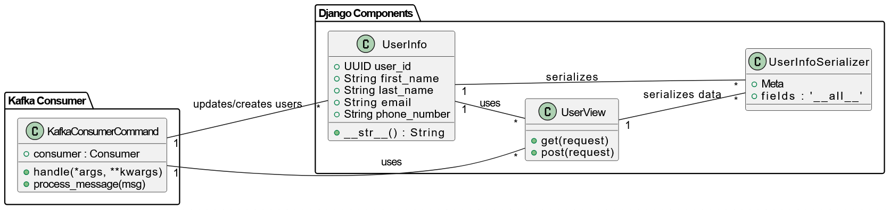

# Parser Service

## Overview

This project involves processing bank messages and extracting transaction details such as amount, currency, and merchant information. It uses a combination of regular expressions and an AI model to handle various types of bank-related messages. The core functionality is exposed through API endpoints, and the processed data is published to a Kafka broker for further processing or analysis.

---

## Index

1. [Theory and Implementation](#theory-and-implementation)
2. [Architecture](#architecture)
3. [API Endpoints](#api-endpoints)
4. [Usage Instructions](#usage-instructions)
5. [License](#license)

---

## Theory and Implementation

### Theory

The project leverages a combination of natural language processing (NLP) and rule-based text extraction techniques to analyze bank-related messages. It integrates:

* **Kafka** for message brokering.
* **Django** for API handling and backend logic.
* **LangChain** and **OpenAI** for NLP-based processing.
* **Regex** for rule-based pattern matching.

### Implementation

1. **Message Parsing**: The system identifies and processes bank-related messages through a mix of predefined keyword matching (via regular expressions) and NLP models (via LangChain and OpenAI).

2. **Expense Extraction**: Once the message is identified as a valid bank message, the system extracts transaction details, such as the amount, merchant, and currency, using both regex and language models.

3. **Kafka Integration**: Processed data is sent to Kafka for further consumption by downstream services.

4. **API Endpoints**: There are two versions of the API endpoint to process messages. These endpoints accept POST requests with a message in the body, process it, and return the extracted data.

---

## Architecture

The architecture of this project involves several key components working together to process messages and interact with Kafka.

### Components:

* **Django Framework**: Handles HTTP requests and serves as the backend for processing messages.
* **KafkaService**: Sends processed data to Kafka for asynchronous processing.
* **LangChainService**: Uses OpenAI's GPT-based models to parse and extract transaction information from messages.
* **RegexService**: Uses regular expressions to extract transaction details like amount, merchant, and currency.
* **MessageService**: The core service that integrates various components, processing messages using either regex or NLP models, depending on the version (v1 or v2).

**Architecture Flow**:

1. **Message Input**: A message (typically a bank SMS or notification) is sent as a POST request to one of the API endpoints.
2. **Message Processing**:

   * For **v1**: The message is processed using regular expressions.
   * For **v2**: The message is processed using LangChain and OpenAI's GPT model.
3. **Expense Extraction**: The relevant data (amount, currency, merchant) is extracted from the message.
4. **Kafka Publish**: The processed data is serialized and sent to Kafka for further consumption.



---

## API Endpoints

### v1/ds/message

* **Method**: POST
* **Description**: This endpoint processes a bank-related message using regular expressions and returns the extracted transaction details.
* **Request Body**:

  ```json
  {
    "message": "You spent 100 USD at Amazon."
  }
  ```
* **Response**:

  ```json
  {
    "amount": "100.00",
    "currency": "USD",
    "merchant": "Amazon"
  }
  ```

### v2/ds/message

* **Method**: POST
* **Description**: This endpoint processes a bank-related message using LangChain and OpenAI's GPT model and returns the extracted transaction details.
* **Request Body**:

  ```json
  {
    "message": "Spent 100 USD at Amazon on your card."
  }
  ```
* **Response**:

  ```json
  {
    "amount": "100.00",
    "currency": "USD",
    "merchant": "Amazon"
  }
  ```

### health

* **Method**: GET
* **Description**: A simple health check endpoint to verify that the server is running.
* **Response**:

  ```json
  {
    "status": "ok"
  }
  ```

---

## Usage Instructions

1. **Install Dependencies**:
   First, clone the repository and install the required dependencies:

   ```bash
   git clone https://github.com/Srinidhi-Yoganand/parserService-django.git
   cd parserService-django
   pip install -r requirements.txt
   ```

2. **Set Up Kafka**:
   Make sure you have Kafka running, and configure your `KAFKA_BROKER` and `KAFKA_TOPIC` in the Django `settings.py` file.

3. **Running the Django Server**:
   To start the Django server, run:

   ```bash
   python manage.py runserver
   ```

4. **Making Requests**:
   Use a tool like Postman or cURL to make POST requests to `/v1/ds/message` or `/v2/ds/message` with the appropriate message data.

5. **Kafka Consumer**:
   Set up a Kafka consumer on the appropriate topic to process the messages published by the `KafkaService`.

---

## License

This project is licensed under the MIT License - see the [LICENSE](LICENSE) file for details.
