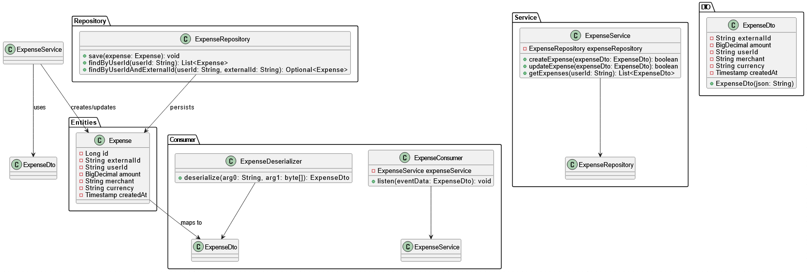

# **System Overview: Expense Tracker Microservices**

This system integrates multiple microservices to handle user information, expenses, transaction parsing, and authentication. The services communicate asynchronously via Kafka, while Kong API Gateway provides a secure entry point for external clients.

### **Key Components:**

1. **Kong API Gateway**: Acts as the entry point for all requests, handling authentication and routing to the appropriate services.
2. **Authentication Service**: Provides secure authentication mechanisms for the entire system.
3. **User Information Service**: Manages user data (name, email, etc.), stores it in MySQL, and listens for updates via Kafka.
4. **Expense Service**: Handles expense data, stores it in MySQL, and listens for messages via Kafka.
5. **Parser Service**: Parses bank messages using NLP and regex, extracting transaction data, and publishing it to Kafka.

All services communicate using **Apache Kafka**, while each service is built using the appropriate framework:

### Technologies Used

- **Spring Boot**
- **Django**
- **Apache Kafka** 
- **MySQL** 
- **JWT** 
- **Kong API Gateway** 
- **Docker** 
- **LangChain**

---

For a more detailed readme, please refer to the specific folder.

## **Table of Contents**

1. [Overview](#overview)
2. [Architecture](#architecture)
3. [Services](#services)

   * [Authentication Service](#authentication-service)
   * [User Information Service](#user-information-service)
   * [Expense Service](#expense-service)
   * [Parser Service](#parser-service)
   * [API Gateway](#api-gateway)
4. [Setup Instructions](#setup-instructions)
5. [API Endpoints](#api-endpoints)
6. [Usage Instructions](#usage-instructions)
7. [License](#license)

---

## **Architecture**

### **Microservice Architecture**

This system follows a **microservices architecture** with the following key components:

* **Kafka**: A message broker for asynchronous communication between services.
* **MySQL**: Used for storing user data and expense data.
* **Kong API Gateway**: Manages routing and authentication for API requests.
* **Docker Compose**: Handles container orchestration for the microservices.
* **Microservices**: Independent services that handle specific tasks like user information, expenses, and authentication.

The services communicate via **Kafka**, and each service listens to specific Kafka topics to receive updates or process events. The communication between services is event-driven, meaning that one service’s output is typically another service’s input.


---

## **Services**

### **Authentication Service**

The **Authentication Service** provides security for all microservices by managing user authentication via OAuth2 and JWT tokens.

**Key Functions**:

* Handles user authentication and authorization.
* Manages JWT token issuance for secure communication.
* Integrates with Kafka for real-time event handling.

**UML Diagram**:

-**signup**


-**login**


-**refresh token**


---

### **User Information Service**

The **User Information Service** manages user data like `user_id`, `first_name`, `last_name`, `email`, and `phone_number`. It supports CRUD operations and listens for updates via Kafka.

**Key Functions**:

* Manages user data via a REST API using Django REST Framework.
* Stores user information in a MySQL database.
* Listens for user data updates through Kafka messages.

**UML Diagram**:


---

### **Expense Service**

The **Expense Service** manages expense data such as `amount`, `currency`, `merchant`, and `user_id`. It stores this data in MySQL and listens for updates via Kafka.

**Key Functions**:

* Handles expense creation, updating, and retrieval via Spring Boot Framework.
* Stores data in a MySQL database.
* Listens for expense-related messages through Kafka.

**UML Diagram**:



---

### **Parser Service**

The **Parser Service** processes bank-related messages to extract transaction details (e.g., `amount`, `currency`, `merchant`) using NLP and regex. The parsed data is then sent to Kafka for further processing.

**Key Functions**:

* Extracts transaction information from bank messages.
* Uses both regex and LangChain (with OpenAI) for NLP-based extraction.
* Publishes parsed data to Kafka for downstream services.

**UML Diagram**:


---
### **API Gateway**

The **API Gateway** acts as the single entry point for all client requests, routing them to the appropriate microservices. It handles request routing, load balancing, and potentially authentication and rate limiting.

**Key Functions**:
* Routes client requests to the correct microservice.
* Provides a unified API endpoint for external consumers.
* Performs load balancing across multiple instances of microservices.
* Can handle cross-cutting concerns like authentication (though in this system, Authentication Service handles the core logic) and rate limiting.


---

## **Setup Instructions**

To set up the project, folllow the following steps

1. Clone the repository:

   ```bash
   git clone https://github.com/Srinidhi-Yoganand/expenseTrackerBackend-Monorepo.git
   cd expenseTrackerBackend-Monorepo
   ```

2. Ensure Docker and Docker Compose are installed.

3. Dokcerize all the services using the docker file in each folder

4. Run the following command to bring up the services:

   ```bash
   docker-compose up -d
   ```

This will start all services, including the Kafka broker, MySQL, and each microservice.

---

## **API Endpoints**

### **Authentication Service**

* **POST /auth/v1/signup**: Register a new user.
* **POST /auth/v1/login**: Log in and get a JWT token.
* **POST /auth/v1/refresh-token**: Get a new JWT token using a refresh token.
* **GET /auth/v1/ping**: Get the authenticated user's ID.

### **Expense Service**

* **GET /expense/v1/getExpense**: Retrieve expenses for a specific user (requires `X-User-Id` header).
* **POST /expense/v1/addExpense**: Create a new expense record (requires `X-User-Id` header).
* **PUT /expense/v1/updateExpense**: Update an existing expense record (requires `X-User-Id` header).
* **GET /expense/v1/health**: Check service health.

### **User Information Service**

* **GET /user/v1/getUser**: Retrieve user information (requires `X-User-Id` header).
* **POST /user/v1/createUpdate**: Create or update user information.

### **Parser Service**

* **POST /v1/ds/message**: Process bank messages using regular expressions.
* **POST /v2/ds/message**: Process bank messages using LangChain and OpenAI models.
* **GET /v1/ds/health**: Check service health.

---

## **Usage Instructions**

1.  **Access**: All services are available via **Kong API Gateway** at `http://localhost:8000`.
2.  **Requests**: Send API requests using tools like Postman or cURL.
    * **Authentication**: Include a **valid JWT token** in the `Authorization: Bearer <token>` header for secured services.
    * **User ID**: Use the **`X-User-Id` header** for Expense and User service requests.
3.  **Kafka**: Set up **Kafka consumers** to process events.

---

## **License**

This project is licensed under the **GNU General Public License v3.0**. See the [LICENSE](LICENSE) file for details.

---
